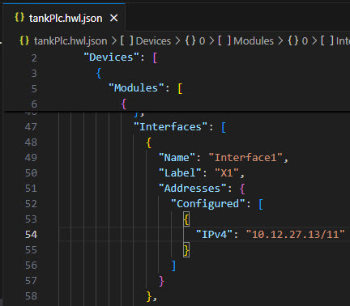
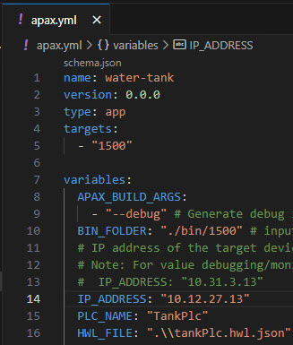
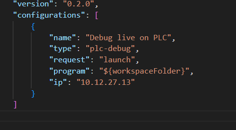
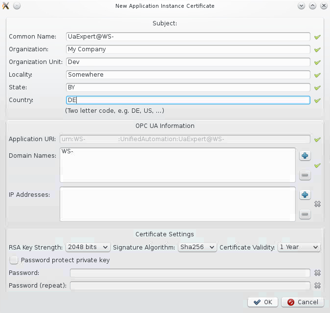
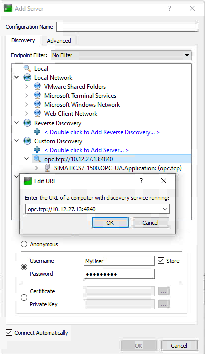
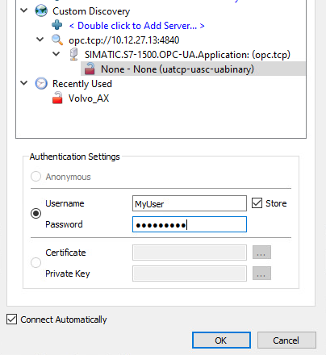
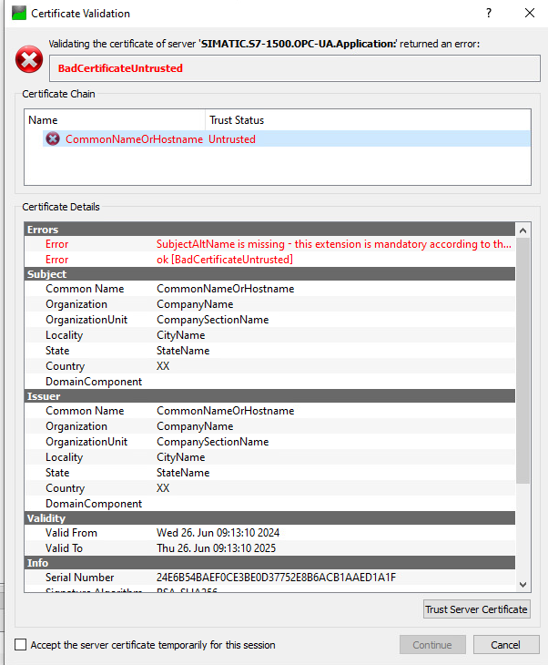
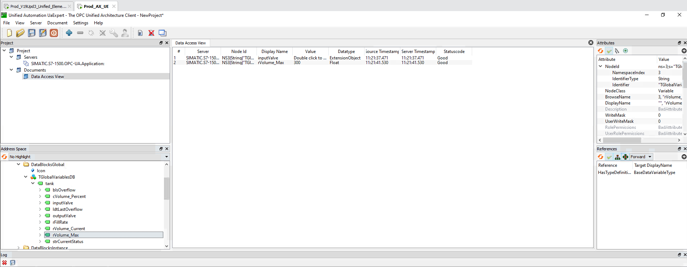

# WaterTank OPC UA connection

## Description

This is an application example of SIMATIC AX to showcase the communication between a PLC and Uaxpert using a protected OPC UA connection. The use-case for this example is to show how a simulated water tank is controlled using a secure OPC UA connection. The PLC and UaExpert communicate to manage the tank's water level by opening and closing valves

## Used components

- Simatic AX
- PLCSIM Advanced V6.0 (PLC FW V3.1)
- UaExpert

## Project Installation

1. Open a command line interface (CLI) and switch to the target folder. E.G, if the target folder is C:/Users/user/Desktop

   ```sh
   C:
   cd \Users\user\Desktop
   ```

2. Install the application example on your local PC.

   Run the following command in the CLI:

   ```sh
   apax create @simatic-ax/ae-opcuaconnection --registry https://npm.pkg.github.com ae-opcuaconnection 
   ```

   Open **AxCode** with

   ```sh
   cd ae-opcuaconnection
   axcode .
   ```

3. If it does not open automatically, open a terminal: (`CTRL+ ´`)

4. Start a PLCSIM Advanced Instance (we are using a FW V3.1 PLC, so please use at least PLCSIm Advanced 6.0) with the same IP address that you will use in the `apax.yml`, the `.vscode/launch.json` and the `tankPlc.hwljson` of the project. To change the IP, [follow the instructions](#prepare-configuration).

  > :warning:
  > You need to have a PLCSIM Adv instance running. Online access must be set to **TCP/IP Single Adapter** with the same IP address and mask configured above.

## How to run this project

We provide you the solution already prepared for being able to run the **OPC UA Server** with just compilling and downloading the hardware and software. The hardware certificates and user configuration were already created from our side. The hardware certificate has been generated using a third-party tool, in this case **OpenSSL**. This certificate must be an X.509 certificate containing the private keys saved as PKCS#12 certificate. These files are located under the _certificate_ folder. This process is out of the scope of this project.

The process to run the project with the opcua interface follows this process:

1. Run _apax install_ to install all the project dependencies.

2. Run the script _setup-hw-certificates_  that will setup the secure communication and then will import the certificate to the hardware.

3. Run the script _set-password_ to enable the password for the user configurated "MyUser".

4. Run the script _create-opcua-interface_ to create the opcua

5. Run the script _hcl_. Here the hardware configuration is compiled and downloaded to the plc instance.

6. Run the script _scl_. The application is built and transferred to the instance.

In addition, there are commands to control the tank from AX side:

- fill: openInputValve
- stopFill: closeInputValve
- empty: openOutputValve
- stopEmpty: closeOutputValve

## Prepare configuration

Modify the IP addresses for your use case, whether if it is running in the same computer or different stations.

Where to modify the IP Addresses in **SIMATIC AX**:

- Modify the IP Address and mask at line 54 in `hwconfiguration\tankPlc.hwl.json`:

    

- Modify the IP Address at line 14 in `apax.yml`:

    

- Modify the IP Address at line 12 in `.vscode\launch.json`

    

## UaExpert  User Documentation

### Introduction

This documentation provides guidance on installing, using, and configuring UaExpert to work with this specific water tank example.

UaExpert is an OPC UA client designed to demonstrate the OPC UA technology. It serves as a versatile test client supporting various OPC UA features, making it an essential tool for developers and testers evaluating OPC UA technology. Further details: [UaExpert website](https://www.unified-automation.com/products/development-tools/uaexpert.html).

## UaExpert Installation

### Download

1. Visit the official [UaExpert website](https://www.unified-automation.com/products/development-tools/uaexpert.html).

2. Download the latest version.

  >Note:
  >You need to register to complete the download.

### Installation Steps

Run the installer and follow on-screen instructions.

## Usage

### Initial Start-Up of UaExpert

When starting UaExpert for the first time, it is necessary to perform some final configuration steps.
An application instance certificate is needed to create a secure channel, identifying the installation of UaExpert. A new dialog window will open, collecting the information which is needed to create such a certificate. Fill out the form and confirm with OK. Red crosses indicate that a required field is still empty.



The new application instance certificate is saved in UaExpert’s PKI certificate store.

## Step-by-Step Connect Example

  >:warning:
  >For being able to follow this guide. You need to have already **downloaded the PLC configuration to a PLC** (e.g. PLCSim Advanced) and have it on **run** state.

In this specific case we are going to add a new connection to the OPC UA Server that is already running on the PLC of this example.

To add a new connection to an OPC UA Server, click on the _+_ button in the toolbar or choose _Server -> Add..._ from the menu. A new dialog window will be displayed. Double-click on _Double click to Add Server_.

Then, add the IP address and the port (default: 4840) of the OPC UA server running on the PLC:



After finding the connection, you can add the credentials of the client configurated in the project:



To actually connect to the server, click on the plug connector button in the toolbar or choose Server → Connect from the menu. A new dialog window for validating the Server’s certificate will open (see screenshot). After examining the certificate, choose **Trust Server Certificate** to permanently add the certificate to UaExpert’s trust list. It is also possible to check the box at **Accept the server certificate temporarily for this session** and choose Continue to not save the certificate in the trust list. If you choose **Cancel** to reject the certificate you cannot proceed.



After successfully add the certificate to the trusted list, the user is able to access to the variables available on the OPC UA server. Then, by drag and drop, its possible to add a visualization of the variables:


*Depending on how the variables were configurated, it is possible to only read them (if they are ReadOnly) or also write them (if they are ReadWrite). In this case, it is also possible to modify the input/output valve related variables and isEmergencyDraining variable.

The user has as well a log display where he can follow every event that is tracked, like for example:


## Contribution

Thanks for your interest in contributing. Everybody is free to report bugs, unclear documentation, and other problems regarding this repository in the issues section, or even better, is free to propose any changes to this repository using Merge Requests.

### Markdownlint-cli

This workspace will be checked by the [markdownlint-cli](https://github.com/igorshubovych/markdownlint-cli) (there is also documented ho to install the tool) tool in the CI workflow automatically.  
To avoid, that the CI workflow fails because of the markdown linter, you can check all markdown files locally by running the markdownlint with:

```sh
markdownlint **/*.md --fix
```

## License and Legal information

Please read the [Legal information](LICENSE.md)
